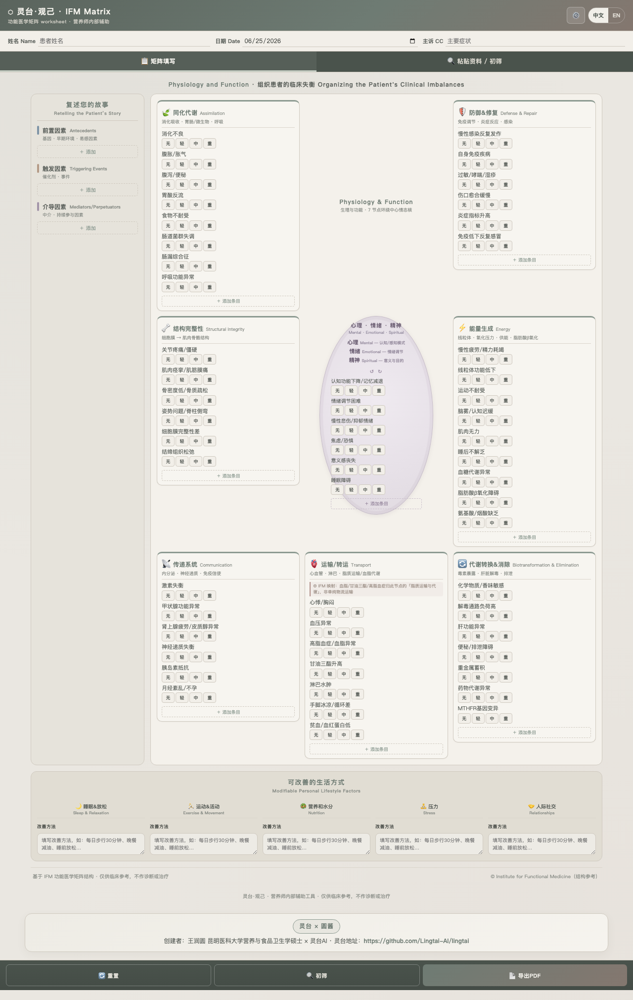
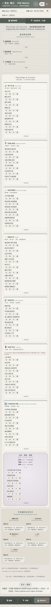

# 灵台·观己 IFM Matrix Worksheet

圆酱（王润圆，昆明医科大学营养与食品卫生学硕士） × 灵台AI 共创的功能医学矩阵 worksheet 试用页。

- Live page: https://9s5bz2jvd2-lang.github.io/lingtai-guanji-ifm-matrix/
- Creator: 王润圆 昆明医科大学营养与食品卫生学硕士 × 灵台AI

## 预览 Preview

### 电脑端 Desktop

### 手机端 Mobile

## 这是什么

许多营养师、健康管理师和功能医学相关从业者，会把大量时间花在梳理、绘制 IFM Matrix 上。AI 不是替代人，而是人的助手和能力放大器。本工具希望让重复、琐碎的整理工作更简单，让专业人员把更多精力放回理解人、帮助人。

LingTai（灵台）是一个支持长期协作、工具调用、多 agent 分工和作品发布的 AI agent 系统。本工具的界面开发、功能实现、文档整理、测试优化和 GitHub Pages 发布，均在 LingTai 协助下完成；专业框架、内容判断、需求定义和最终审核由王润圆本人完成。

This is a public trial IFM Matrix worksheet co-created by Runyuan Wang and LingTai AI. LingTai helped with interface development, implementation, documentation, testing, optimization, and GitHub Pages publication; the professional framework, content judgment, requirements, and final review were completed by Runyuan Wang herself.

## 当前版本

- 标准 IFM Matrix worksheet 结构：左侧 ATM，中部 7 个 physiology nodes + 中心 MES，底部 5 个 lifestyle factors。
- 低饱和 Morandi 医疗软件风格，适配桌面与手机。
- `Transport` 节点含脂质运输 / 血脂代谢说明，避免将血脂问题误解为普通物流传输。
- 导出按钮调用浏览器打印 / PDF；页面不上传病例资料，不内置 API key。
- MiMo / OpenAI-compatible API 可选：2026-06-25 已用 MiMo OpenAI-compatible endpoint 做本地页面连通性测试，页面显示 `Connection OK`。测试未写入、未公开任何 API key。

## 使用方法

1. 打开 Live page。
2. 在顶部填写姓名、日期、主诉等基本信息；试用时请勿输入可识别真实患者身份的信息。
3. 在左侧 ATM 区梳理 Antecedents / Triggers / Mediators。
4. 在中部 7 个功能医学节点中整理同化、防御修复、能量、传递、运输、结构、排泄等线索。
5. 在底部 Lifestyle 区为睡眠放松、运动活动、营养水分、压力、人际社交填写可执行的改善方法；这里不是程度评分。
6. 如需 AI 辅助，可打开「AI 接口设置」，填写自己的 MiMo 或 OpenAI-compatible Base URL、模型名与 API Key；API Key 仅存于页面内存，刷新即清。
7. 点击「导出PDF」，使用浏览器打印功能保存为 PDF。

## MiMo API 设置示例

> 请使用你自己的 MiMo API key；不要把真实 key 提交到 GitHub、截图或发给他人。

- Base URL: `https://api.xiaomimimo.com/v1`
- Model: `mimo-v2.5-pro`
- API Key: 在页面的「AI 接口设置」里临时填写；刷新页面即清除。

## 免责声明 Disclaimer

本工具仅用于健康信息整理、功能医学矩阵绘制、学习交流与科普辅助；不构成诊断、治疗、用药、营养治疗处方或临床决策依据，不能替代医师、临床营养师、注册营养师等专业人员评估。如有疾病、症状、用药或不适，请咨询专业人员；紧急情况请立即就医。

This tool is for health-information organization, IFM Matrix mapping, learning, communication, and public education only. It does not provide diagnosis, treatment, medication advice, nutrition therapy prescriptions, or clinical decision-making, and it cannot replace assessment by qualified healthcare professionals. If you have any disease, symptoms, medication use, or discomfort, please consult a qualified professional; in an emergency, seek medical care immediately.

## 一句话

天道无亲，常与善人。我相信，多为别人指路，也会有人为你指路。

The Way of Heaven is impartial and often stands with those who do good. I believe that when we light the way for others, someone will one day light the way for us.
